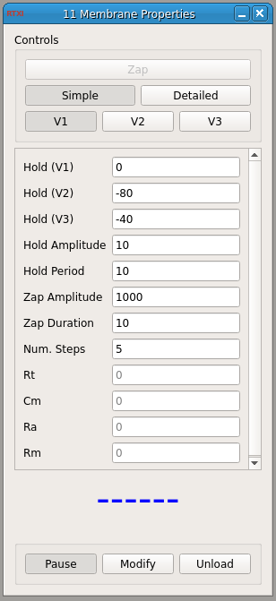

###Membrane Test

**Requirements:** None  
**Limitations:** None  

Generates a square wave pulse with amplitude equal to one of the user-set hold potentials. The first half is the resting potential plus the amplitude of the wave, and the second half is just the resting potential.

Using current input gained while the pulse is running, the module can calculate the membrane resistance (Simple option) or multiple resistance and capacitance (Detailed option)

####Input Channels
1. input(0) : current input (A)

####Output Channels
1. output(0) : voltage output (V)

####Parameters
1. Hold (V1) - holding potential option 1 (mV)
2. Hold (V2) - option 2
3. Hold (V3) - option 3
4. Hold Amplitude - amplitude of the square wave pulse
5. Hold Period - period of the square wave (ms)
6. Zap Amplitude - amplitude of a zap (mV)
7. Zap Duration - duration (ms)
8. Num. Steps - number of steps to average for the detailed calculations

####States
1. Rt - total resistance (Ohms)
2. Cm - capacitance
3. Ra - access resistance
5. Rm - membrane resistance
